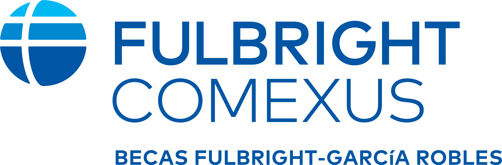

# Campaña Phygital — Beca Fulbright-García Robles · Posgrado Regular

Del volante impreso al pre-registro digital. Un código QR en papel lleva a una landing page
orientada a conversión; **dos modelos de diseño distintos** compiten por el mismo objetivo.

El 99 % del tráfico llega por teléfono, así que las dos páginas son **mobile-first en
retrato**: proporciones verticales, tipografía dimensionada para la mano, y gestos táctiles
en lugar de eventos de ratón.

---

## Contenido

```
modelo-1-scrollytelling.html         Relato guiado por scroll con mapa SVG animado
modelo-2-bento-vertical.html         Bento apilado, glassmorphism, sin motores 3D
docs/
  01-copy.md                         Hook del volante y microcopy de las landings
  02-zapier.md                       Pre-registro y recordatorios automáticos
  preregistro.schema.json            Esquema del payload de pre-registro
tools/
  build_artifacts.py                 Genera fragmentos publicables desde los HTML
archivo/                             Versiones anteriores del encargo (v1: icosaedro;
                                     v2: globo y mapa 3D en WebGL), como referencia
```

Los dos HTML son **autónomos**: CSS y JavaScript embebidos, sin build, sin fuentes externas,
sin dependencias obligatorias. Se abren con doble clic.

---

## Los dos modelos

### Modelo 1 — Del Ángel a la Antorcha

Un relato guiado por el scroll. El escenario queda fijo bajo el encabezado mientras las
tarjetas de contenido pasan por debajo, y el desplazamiento mueve una **cámara sobre un mapa
SVG** de México y Estados Unidos: arranca cerrada sobre Ciudad de México, se abre a las tres
ciudades emisoras, cruza la frontera y termina en el noreste. Seis **trayectorias que se
trazan solas** unen Ciudad de México, Monterrey y Guadalajara con Los Ángeles, Austin,
Houston, Miami y Nueva York. El **Ángel de la Independencia** cede el sitio a la **Estatua de
la Libertad** a mitad del trayecto, en SVG 2D.

- **Un solo cálculo gobierna todo.** El avance del scroll dentro del relato produce un valor
  entre 0 y 1, y de ahí salen el encuadre de la cámara, el trazado de cada arco, la
  transición entre monumentos y la barra de progreso. No hay animaciones sueltas que se
  desincronicen.
- **Diseño geográfico minimalista, sin rótulos.** Las ciudades son solo marcadores —punto y
  halo en azules institucionales— unidos por sus rutas; no llevan nombre en el mapa. Cada
  grupo de ciudad compensa la escala de la cámara y los trazos usan
  `vector-effect: non-scaling-stroke`, así que ni los marcadores ni las fronteras se
  deforman a 2.7 aumentos.
- **`prefers-reduced-motion`** entrega el mapa completo, los seis arcos trazados y los dos
  monumentos a la vez, sin movimiento.
- **Formulario de un paso, tres campos** — máxima tasa de conversión.

### Modelo 2 — Corredor Fulbright

Interfaz contemporánea sin animaciones de scroll: **bento apilado en vertical** (1 columna en
móvil, 4 a partir de 46rem, 6 a partir de 70rem), **glassmorphism** sobre el degradado
corporativo con auroras en movimiento, Montserrat de peso 800 con tracking negativo y
micro-interacciones —reflejo que sigue al dedo, revelado escalonado, contadores de monto,
reloj de cierre al segundo—.

La pieza de acompañamiento es la **única tarjeta de fondo blanco** del bento: en una pila de
vidrio azul, invertir el valor es lo que hace que un bloque destaque sin gritar.

- **Zonas táctiles de 56 px** en todos los controles.
- Control segmentado para alternar entre «Sí puedes» y «No aplica» en elegibilidad.
- **Formulario de dos pasos, seis campos** — menos conversión bruta, mucha mejor
  segmentación de la secuencia de correos.

---

## Identidad oficial

Aplicada según la Fulbright Brand Guide:

| | |
|---|---|
| Titulares, cifras, interfaz | **Montserrat** (Google Fonts, pesos 400–800) |
| Citas y acentos formales | **Source Serif 4** en cursiva |
| Legacy Blue `#003DA5` | Corporativo primario |
| Azure Blue `#0077C8` | Secundario y transiciones |
| Sky Blue `#00A9E0` | Acentos y resaltados |
| Blanco, `#C7C9C7`, `#707372` | Fondos y textos de soporte |

**Una advertencia de contraste que conviene conocer.** Sky Blue es un color de acento: sobre
blanco da 2.5:1 y sobre el azul del bento menos de 2:1, ambos por debajo del mínimo de la
WCAG. En las dos páginas pinta **solo gráficos** —arcos, halos, bordes, la antorcha, las
reglas, la barra de progreso—; el texto usa Legacy Blue, Azure Blue o blanco según el fondo.
Se ve igual de vivo y se lee.

Ambas páginas abren con un **sticky header** con un `` listo para
recibir el logotipo oficial:

```html

```

Para activarlo, **coloca el PNG que entregue COMEXUS junto a cada HTML** con el nombre
`logo-fulbright-comexus.png` —o cambia el `src` por su URL, si se va a alojar aparte—. No hay
que tocar nada más del encabezado. Mientras el archivo no exista, el `onerror` del propio
`` lo oculta y muestra en su lugar un lockup de texto (`Fulbright COMEXUS · Becas
Fulbright-García Robles`) para que el encabezado nunca se vea roto. En el Modelo 2 el logo
va además sobre un chip blanco, porque el fondo del encabezado es oscuro y no se sabe de
antemano si el archivo real tiene tinta clara u oscura.

### Pie de página con contacto

Las dos páginas cierran con un bloque de contacto en el pie, en dos grupos:

```html
<!-- Correos para recepción de solicitudes -->
<a href="mailto:becas@comexus.org.mx">becas@comexus.org.mx</a>
<a href="mailto:fernanda.chaparro@comexus.org.mx">fernanda.chaparro@comexus.org.mx</a>

<!-- Sitio web oficial -->
<a href="https://www.comexus.org.mx" target="_blank" rel="noopener">www.comexus.org.mx</a>
```

---

## Configuración por ciclo

Cada landing tiene un único bloque de configuración al inicio de su `<script>`:

```js
const CONFIG = {
  CIERRE: new Date('2026-01-31T23:59:59-06:00'),
  APERTURA_SIGUIENTE: '1 de septiembre',
  ENDPOINT: '',            // URL del Catch Hook de Zapier. Vacío = modo demo.
  VARIANTE: 'modelo-1-recorrido-binacional'
};
```

Cambiar `CIERRE` recalcula el contador, la píldora de estado, la etiqueta del CTA, el texto
del dock y el mensaje de confirmación.

### Estado «convocatoria cerrada»

Cuando la fecha de cierre ya pasó, ambas páginas cambian solas de discurso: dejan de
prometer una postulación imposible y ofrecen aviso para la siguiente apertura. No hay que
despublicar nada ni editar textos con prisa.

Con `ENDPOINT` vacío el formulario funciona en **modo demo**: valida, muestra la
confirmación y escribe en la consola el payload exacto que recibiría Zapier.

---

## Verificación

Probado en Chromium (Playwright) a 390 × 844 con emulación táctil, y a 1440 px.

| Comprobación | Resultado |
|---|---|
| Errores de consola y de JavaScript | Ninguno |
| Desbordamiento horizontal (390 y 1440 px) | Ninguno |
| Montserrat y Source Serif 4 | Cargan en los dos modelos y en los fragmentos publicados |
| Modelo 1: recorrido de la cámara | Encuadre, arcos, monumentos y progreso avanzan sincronizados |
| Modelo 1: marcadores del mapa a cualquier zoom | Sin rótulos de texto; tamaño constante y trazos que no engordan |
| Logotipo del encabezado fijo | Presente y legible en los dos modelos |
| Zonas táctiles por debajo de 44 px | Ninguna |
| Contador con convocatoria abierta | 61 d 13 h 59 m 12 s, avanza al segundo |
| Estado de convocatoria cerrada | Píldora, reloj, hito, dock, CTA y formulario cambian a la vez |
| Formulario: paso vacío, correo inválido, consentimiento | Bloquea y enfoca el primer campo con error |
| Formulario: envío completo | Muestra confirmación y mueve el foco |
| Montos sin JavaScript | Se leen correctos: la cifra real vive en el HTML |

---

## Pendiente antes de publicar

- [ ] Colocar `logo-fulbright-comexus.png` junto a cada HTML (el `` ya está
      configurado para recibirlo; ver «Identidad oficial» arriba).
- [ ] Pegar la URL del Catch Hook de Zapier en `CONFIG.ENDPOINT`.
- [ ] Enlazar el aviso de privacidad real de COMEXUS (hoy es un ancla interna).
- [ ] Confirmar cifras, fechas y criterios de elegibilidad contra la convocatoria oficial
      vigente.

---

## Dos notas

**Sobre el calendario.** El material usa las fechas del brief: convocatoria del 1 de
septiembre de 2025 al 31 de enero de 2026, con inicio de estudios en agosto de 2027. Ese
periodo ya concluyó, de modo que hoy las páginas se muestran en su estado de convocatoria
cerrada. Para activar el ciclo vigente basta actualizar `CIERRE`.

**Sobre `user-scalable=no`.** El brief pide esa etiqueta de viewport y está puesta tal cual.
Conviene saber que bloquea el zoom del navegador, lo que incumple el criterio WCAG 1.4.4 y
afecta a quien necesita ampliar el texto. Las páginas están construidas para no necesitarlo
—cuerpo de 16 px mínimo, controles de 52–56 px—, así que quitar `maximum-scale=1.0,
user-scalable=no` no cambia nada del diseño y devuelve el zoom. Es una decisión de una línea.
